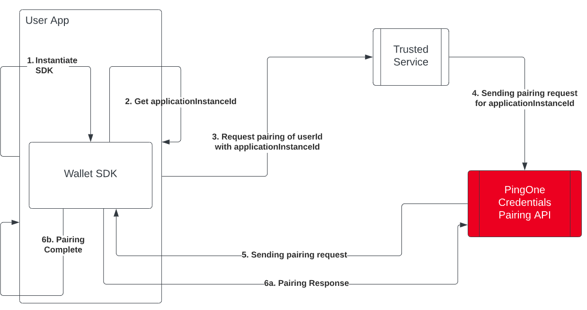
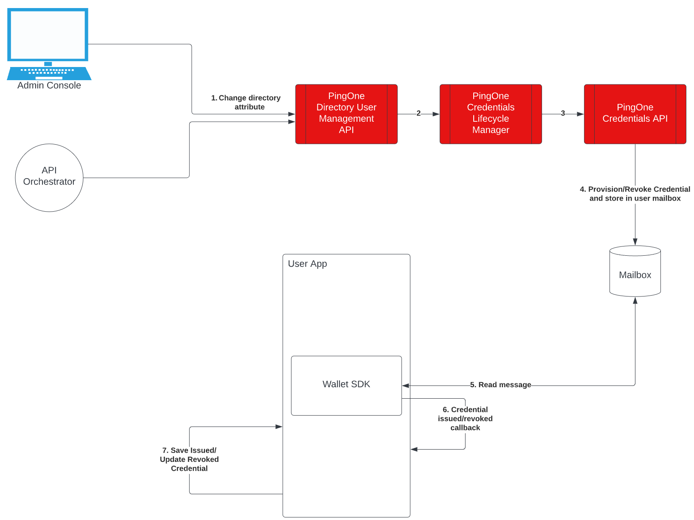

# PingOne Wallet Native SDK for Android

This defines the usage and interfaces of the PingOne Wallet SDK for Android to interact with PingOne
credentialing services. The SDK provides for a user to receive, save, and share credentials for
identification and verification purposes.

## Running the sample app

### Installation prerequisites

* Android Studio with Gradle
* Android SDK 26 and later

### Set up and clone or download

1. Clone or download the PingOne Wallet SDK for Android sample code to your computer. The Sample
   Code directory contains the Android project that is ready to be built when the prerequisites are
   satisfied.

2. To open the sample app as a project in Android Studio, go to File --> New --> Import Project.
   Choose the build.gradle from the root folder and open the file to configure the project.

## Integrating PingOne Wallet SDK for Android with a pre-existing application

### Getting started: Add the aar needed for your application

If you haven't done so already, clone or download the PingOne Wallet SDK for Android sample app. You
will find the `PingOneWallet-2.0.2.aar` dependency required for the PingOne Wallet Android SDK in
the SDK dependencies directory.

1. Add the following to your module level `build.gradle` file to include the dependencies in your
   module:

```
    dependencies {
        implementation fileTree(dir: '../dependencies/', include: ['*.aar'], exclude: [])
        ...
    }
```

Note `../dependencies/` should point to where you are storing the `PingOneWallet-2.0.2.aar`

2. Because these components are loaded locally, you will also need to include the SDK's dependencies
   in the configuration to compile and run it.

```
    dependencies {
        implementation fileTree(dir: '../dependencies/', include: ['*.aar'], exclude: [])

        implementation 'org.apache.httpcomponents:httpclient:4.5.13'
        implementation 'org.bitbucket.b_c:jose4j:0.8.0'
        implementation 'io.reactivex.rxjava3:rxjava:3.0.12'
        implementation 'io.reactivex.rxjava3:rxandroid:3.0.0'
        implementation 'com.squareup.retrofit2:converter-moshi:2.7.2'
        implementation 'com.squareup.retrofit2:converter-gson:2.7.2'
        implementation 'com.squareup.retrofit2:converter-scalars:2.7.2'
        implementation 'com.squareup.retrofit2:adapter-rxjava3:2.9.0'
        implementation 'com.squareup.retrofit2:retrofit:2.9.0'
        implementation 'com.squareup.okhttp3:okhttp-urlconnection:4.9.3'
        implementation 'io.github.erdtman:java-json-canonicalization:1.1'

        implementation 'androidx.security:security-crypto:1.1.0-alpha04'
        implementation 'androidx.security:security-identity-credential:1.0.0-alpha03'
        implementation 'androidx.biometric:biometric:1.1.0'

        implementation 'javax.inject:javax.inject:1'

        implementation 'androidx.appcompat:appcompat:1.6.1'
        implementation 'com.google.android.material:material:1.9.0'
        testImplementation 'junit:junit:4.13.2'
        androidTestImplementation 'androidx.test.ext:junit:1.1.5'
        androidTestImplementation 'androidx.test.espresso:espresso-core:3.5.1'
     }
```

3. Add the following the packaging options to your module level `build.gradle` to avoid build errors
   happening due to duplicate file `META-INF/DEPENDENCIES` being added from multiple libraries when
   packaging the app.:

```
    android {
    ...
        packagingOptions {
            exclude("META-INF/DEPENDENCIES")
        }
    ... 
    }   
```

4. Copy
   the [Wallet Folder](SampleCode/app/src/main/java/com/pingidentity/sdk/pingonewallet/sample/wallet)
   into your application. This contains the neccessary interfaces and the PingOneWalletHelper for
   the PingOneWallet.

5. Initialize the PingOneWalletHelper. Store the instance helper returned for interacting with the
   Wallet SDK.

```
 PingOneWalletHelper.initializeWallet(this, helper -> {
        pingOneWalletHelper = helper;
    }, throwable -> {
        //Handle error here
    });
```

6. (Optional) Set optional ApplicationUiHandler to handle UI notifications/Alerts. Set optional
   CredentialPicker implementation to handle credential selection when multiple credentials of the
   same type are present in the wallet matching the criteria in a presentation request. An
   example [ApplicationUiHandler implementation](SampleCode/app/src/main/java/com/pingidentity/sdk/pingonewallet/sample/ui/ApplicationUiHandlerImpl.java)
   and an
   example [CredentialPicker implementation](SampleCode/app/src/main/java/com/pingidentity/sdk/pingonewallet/sample/ui/picker/default_impl/DefaultCredentialPicker.java)
   can be found in
   the [ui folder](SampleCode/app/src/main/java/com/pingidentity/sdk/pingonewallet/sample/ui).

```
    private void setHandlerandPicker(PingOneWalletHelper pingOneWalletHelper, ApplicationUiHandler applicationUiHandler, CredentialPicker       credentialPicker) {
        pingOneWalletHelper.setApplicationUiHandler(applicationUiHandler);
        pingOneWalletHelper.setCredentialPicker(credentialPicker);
    }
```

### Installation and configuration

Set up Android push messaging.

### App prerequisites

Ensure you have the following information needed to set up push notifications for your PingOne
Wallet application using Firebase Cloud Messaging (FCM):

* Server Key

* Package Name

* google-services.json configuration file

See the Firebase
guide [Add Firebase to your Android](https://firebase.google.com/docs/android/setup) for more
information.

### Configure push notifications

1. Add the google-services.json file to your app and copy the Server Key from your project in the
   Firebase Console.

2. See the PingOne documentation
   for [Adding an application - Native](https://docs.pingidentity.com/r/en-us/pingone/p1_add_app_worker)
   to register your wallet app.

3. After adding your wallet application, go to Mobile -> Edit () -> Configure for Android -> Add
   Push Notifications

4. Add the Package Name and paste your Server Key from step 1 here.

5. Save your changes.

See the PingOne
documentation [Edit an application - Native](https://docs.pingidentity.com/r/0ue6NPmZLPN667l6iXUjRg/G7CfTYed9WCeNzmfcno0Pw)
for more information.

### Using app links

Follow the [Android guide](https://developer.android.com/studio/write/app-link-indexing) to set up
app links for your application.

Application developers are responsible for implementation of the App Links. You can follow the steps
documented
in [Getting started with PingOne Credentials](https://docs.pingidentity.com/r/en-us/pingone/pingone_p1credentials_gettingstart)
to configure the app link in your PingOne environment for your mobile application.

Here’s a sample link generated for initiating wallet pairing and also for requesting a credential
from wallet (assuming your app is set up to work with `https://yourwallet.com/neo`):

`https://yourwallet.com/neo?u=https%3A%2F%2Fapi.pingone.com%2Fv1%2Fdistributedid%2Frequests%2F80cd25d0-5371-4bb2-b64fc0183c43d44d`

* This URL is generated by the credentials service using the configured Digital Wallet Link.

* The value for the URL query parameter key u is the request URL that contains the payload.

* Pass the full URL string to `PingOneWalletClient.processQrContent` method and the SDK will fetch
  the response from the embedded request URL and forward the pairing or presentation request via
  callback method, `WalletCallbackHandler.handleCredentialRequest`.

### Handling App Links in Android

    public void processQrContent(@NonNull final String qrContent) {
        mPingOneWalletClient.processQrContent(qrContent);
    }
    //WalletCallbackHandler methods
    @Override
    public void handleCredentialRequest(PresentationRequest presentationRequest) {
        //Handle the pairing/presentation request here as documented in the integration examples
    }

Existing applications already configured with an app link can register the same URL as the digital
wallet link in the PingOne environment.

### Server Side configuration

See [Edit an application](https://docs.pingidentity.com/r/en-us/pingone/pingone_edit_application_native)
in the admin guide for the server-side configuration steps.

## Class Reference

Refer to the documentation [here](https://pingidentity.github.io/pingone-wallet-mobile-sdk-android)


## Integration Examples

This section explains how to integrate the wallet SDK for various use cases.

- [Integrate the SDK with no user interaction (silent mode)](#initialization-and-wallet-pairing)

### Integrate the SDK with no user interaction

The sample app is designed for the use case where the wallet SDK embedded in the application is
paired with a PingOne environment by an explicit pairing request initiated by the PingOne
environment. In that pairing process the PingOne environment admin sends an email to the user with a
Universal Link to open the wallet application to complete the pairing.

This example illustrates how to integrate the digital wallet SDK with no user interaction (silent
mode).

- [Initialization and wallet pairing](#initialization-and-wallet-pairing)
- [Issuance and revocation](#issuance-and-revocation)
- [Presentation](#presentation)

### Initialization and wallet pairing

The illustrated workflow is followed to instantiate a wallet SDK that triggers a pairing request
from the app. We must instantiate the wallet SDK and get the `applicationInstanceId`, which is a
UUID that uniquely identifies the wallet SDK instance in the app. This `applicationInstanceId` is
sent to a server trusted by the app. The server in turns calls a PingOne API to initiate and
silently complete the wallet pairing.



#### Steps 1 and 2 - Get the applicationInstanceId

The script below instantiates the wallet SDK to trigger a pairing request from the app. To
instantiate the wallet SDK requires the `applicationInstanceId`, which is a UUID that uniquely
identifies the wallet SDK instance in the app. This `applicationInstanceId` must be sent to a server
trusted by the app. The server in turns calls a PingOne API to initiate and silently complete the
wallet pairing.

This code requires that:

- The application has already established the user to which the wallet belongs using existing
  authentication means
- The application has a trusted service backend with which it can communicate.

Modified code from
the [PingOneWalletHelper.java](SampleCode/app/src/main/java/com/pingidentity/sdk/pingonewallet/sample/wallet/PingOneWalletHelper.java)
file to get the `applicationInstanceId` from the instantiated SDK to enable backend pairing request.

```
    final PingOneWalletClient.Builder clientBuilder = new PingOneWalletClient.Builder(true, PingOneRegion.NA);
    // set storage manager for easy management of encrypted storage
    if (storageManager != null) {
        clientBuilder.setStorageManager(storageManager);
    }
    // Using the builder pattern, once the clientBuilder is setup
    Completable.fromRunnable(() -> new PingOneWalletClient.Builder(context, PingOneRegion.NA)
                        .useDefaultStorage(fragmentActivity)
                        .build(pingOneWalletClient -> {
                            PingOneWalletHelper helper = new PingOneWalletHelper(pingOneWalletClient, context);
                            onResult.accept(helper);
                        }, onError))
                .subscribeOn(Schedulers.io())
                .observeOn(AndroidSchedulers.mainThread())
                .subscribe();
```

#### Step 3 - Request pairing

Send a request to pair `userId` from the application with the `applicationInstanceId` of the wallet
SDK. This requires custom code and the details depend on the application. Ping Identity recommends
that mobile applications do not directly call the PingOne OAuth APIs.

#### Step 4 - Create a user and pair the wallet

Call the PingOne APIs to create a user in your PingOne environment and pair a digital wallet.

[Create user](https://apidocs.pingidentity.com/pingone/platform/v1/api/#post-create-user) API

`curl -X POST https://api.pingone.com/v1/environments/abfba8f6-49eb-49f5-a5d9-80ad5c98f9f6/users`

[Create digital wallet](https://apidocs.pingidentity.com/pingone/platform/v1/api/#post-create-digital-wallet)
API

`curl -X POST https://api.pingone.com/v1/environments/abfba8f6-49eb-49f5-a5d9-80ad5c98f9f6/users/49825b76-e1df-4cdc-b973-0c580f1cb049/digitalWallets`

with a body similar to

```
Authorization: Bearer {{accessToken}}
Content-type: application/json

{
    "digitalWalletApplication": {
        "id": "{{digitalWalletApplicationID}}"
    },
    "applicationInstance": {
        "id": "{{applicationInstanceId}}"
    }
}
```

#### Step 5 - Pairing request

PingOne sends a pairing request to the wallet SDK embedded in the user app identified by the
applicationInstanceId.

1. The pairing request contains a “cryptographically secure random challenge string” that the wallet
   SDK signs and returns to the PingOne credentials service.

2. PingOne credentials service sends an end-to-end encrypted message to the wallet SDK embedded in
   the user app. The PingOne Mailbox Service sends this message.

3. The wallet SDK inside the app polls the PingOne Mailbox service every 3 seconds.
   **Note**: This is default behavior so there is no need to write additional code or make any
   modifications.

4. When the app receives the encrypted message from the PingOne Credentials service, it decrypts the
   message and calls the registered message handler as defined
   in [PingOneWalletHelper.java](SampleCode/app/src/main/java/com/pingidentity/sdk/pingonewallet/sample/wallet/PingOneWalletHelper.java).

5. Code below is modified
   from [PingOneWalletHelper.java](SampleCode/app/src/main/java/com/pingidentity/sdk/pingonewallet/sample/wallet/PingOneWalletHelper.java)
   to ensure that no user interaction is required to complete the pairing process. This is a method
   in the WalletCallbackHandler interface implemented in the PingOneWalletHelper.java file.

6. Modify the handlePairingRequest private method in
   the [PingOneWalletHelper.java](SampleCode/app/src/main/java/com/pingidentity/sdk/pingonewallet/sample/wallet/PingOneWalletHelper.java)
   as follows. This ensures that no user interaction is required to complete the pairing process.
   This is a method in the WalletCallbackHandler interface which is implemented in the
   PingOneWalletHelper.java file.

```
private boolean handlePairingRequest(@NonNull final PresentationRequest presentationRequest) {

    PairingRequest pairingRequest = presentationRequest.getPairingRequest();
    if (pairingRequest == null) { 
        return false
    }
    BackgroundThreadHandler.singleBackgroundThreadHandler().post(new Runnable() {
      @Override
      public void run() {
          try {
              mPingOneWalletClient.pairWallet(pairingRequest, null);
          } catch (Exception e) {
              Log.e(TAG, "Failed to pair wallet", e);
          }
      }
    });
    return true;
}
```

#### Step 6 - Wallet pairs

The call to SDK method `pairWallet` (on line 7 in the modified code) responds to the pairing request
and the app pairs with the user in the PingOne environment. This corresponds to steps 6a and 6b in
the illustrated workflow.

### Issuance and revocation

To implement the credential issuance and revocation workflow requires changes to the sample app
code.

#### Modify the sample app code

The sample app uses popup messages (also called toasts) to alert the user that the wallet SDK has
received a notification about an issued credential or a revoked credential. You must modify the code
to mute the popup messages and in the sample app.

#### Step 7 - Modify the sample app code

The illustrated workflow requires modification of
the [PingOneWalletHelper.java](SampleCode/app/src/main/java/com/pingidentity/sdk/pingonewallet/sample/wallet/PingOneWalletHelper.java)
file to not display a popup when a credential issuance request is received.

```
    @Override
    public boolean handleCredentialIssuance(String issuer, 
            String message, 
            Challenge challenge, 
            Claim claim, 
            List<WalletException> errors) {
        Log.i(TAG,"Credential received: Issuer: " + issuer + " message: " + message);
        mDataRepository.saveCredential(claim);
        return true;
    }
    
    @Override
    public boolean handleCredentialRevocation(String issuer, 
            String message, 
            Challenge challenge, 
            ClaimReference claimReference, 
            List<WalletException> errors) {
        Log.i(TAG,"Credential revoked: Issuer: " + issuer + " message: " + message);
        mDataRepository.saveCredentialReference(claimReference);
        return true;
    }
```

#### Complete process for issuance and revocation



1. An API orchestration layer or an administrator using the Admin Console makes changes to user
   attributes in the user directory.

2. The PingOne Credentials Lifecycle Manager listens to directory change events and reviews the
   changes to determine if credentials must be issued or revoked based on credential issuance rules.
   If a credential needs to be issued or revoked the lifecycle manager makes entries in the staging
   area.

3. The PingOne Credentials API is invoked periodically to process all staged changes. The PingOne
   Credentials API issues or revokes credentials as determined by the Lifecycle Manager.

4. The credentials that are issued or revoked are bound to the wallet and are sent to the wallet
   using secure end-to-end encrypted messages using the Mailbox functionality of the PingOne Neo
   platform.

5. The Wallet SDK embedded inside the app polls the Mailbox API to check for new messages. The
   mailbox API returns newly issued or recently revoked credential message as an encrypted message
   meant for the SDK to read.

6. The Wallet SDK calls the app via the callback method `handleCredentialIssuance`
   or `handleCredentialRevocation` which the app has registered via the callback handler described
   earlier.

7. The User App handles the callback by storing the issued credential to or deleting the revoked
   credential from storage using storage manager implementation.

### Presentation

The sample app uses the `PingOneWalletHelper` class
in [PingOneWalletHelper.java](SampleCode/app/src/main/java/com/pingidentity/sdk/pingonewallet/sample/wallet/PingOneWalletHelper.java)
to handle links, QR code content, and push notification requests for presentation of credentials.

These lines of code in
the [PingOneWalletHelper.java](SampleCode/app/src/main/java/com/pingidentity/sdk/pingonewallet/sample/wallet/PingOneWalletHelper.java)
must be changed to allow for silent responses to presentation requests. Replace
the `handleCredentialRequest` method with the code below.

```
@Override
public void handleCredentialRequest(PresentationRequest presentationRequest) {

    // Handle wallet pairing request
    if (presentationRequest.isPairingRequest()) {
        handlePairingRequest(presentationRequest);
        return;
    }

    // Search for credentials matching the presentation request from the data repository
    final List<Claim> allClaims = mDataRepository.getAllCredentials();
    final List<CredentialMatcherResult> credentialMatcherResults = mPingOneWalletClient
        .findMatchingCredentialsForRequest(presentationRequest, allClaims).getResult();

    boolean matchingCredentials = false;

    if (credentialMatcherResults != null) {
      for (CredentialMatcherResult credentialMatcherResult : credentialMatcherResults) {
        if (!credentialMatcherResult.getClaims().isEmpty()) {
          matchingCredentials = true;
          break;
        }
      }
    }

    if (!matchingCredentials) {
      // TODO: Application dependent custom handling
      // Handle no matching credential found in user's wallet
      return;
    }

    // TODO: Application dependent custom handling
    // handle logic to select the credential to present if
    // multiple matching credentials are found in the wallet.

    // handle presentation of the credentials (assuming that only
    // one credential in the wallet matched the criteria in the presentation
    // request)

    CredentialsPresentation credentialsPresentation = new CredentialsPresentation(presentationRequest);
    credentialsPresentation.addClaimForKeys(
        presentationRequest.getStringKeys(),
        credentialMatcherResults.get(0).getClaims().get(0));

    // POSTing the credential response back needs to be done on the background thread 
    BackgroundThreadHandler.singleBackgroundThreadHandler()
        .post(() -> mPingOneWalletClient.presentCredentials(credentialsPresentation)
            .subscribeOn(Schedulers.io())
            .observeOn(AndroidSchedulers.mainThread())
            .subscribe(presentationResult -> {
              switch (presentationResult.getPresentationStatus().getStatus()) {
                case SUCCESS:
                  // Credential presentation successful
                  break;
                case FAILURE:
                  // Credential presentation failed
                  if (presentationResult.getError() != null) {
                    Log.e(TAG, "\"Error sharing information: ",
                        presentationResult.getError());
                  }
                  Log.e(TAG, String.format("Presentation failed. %s",
                      presentationResult.getDetails()));
                  break;
                case REQUIRES_ACTION:
                  // Handle the action sent by the verifier
                  // for the wallet as response to the presentation
              }
            }));
}
```
